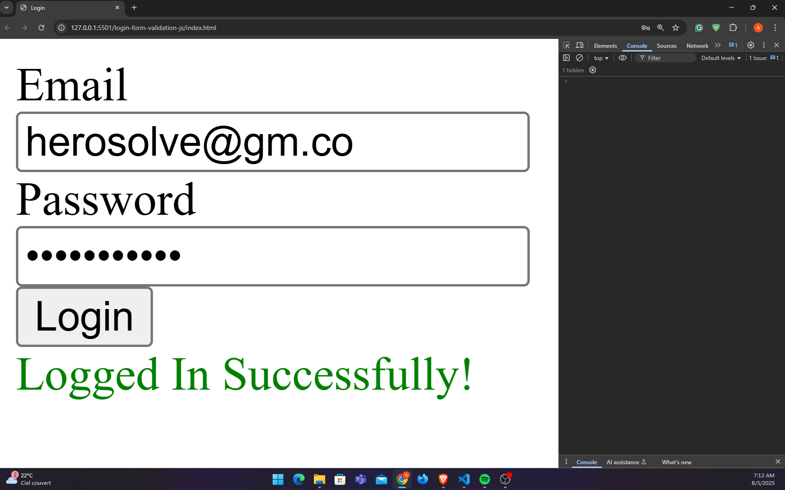

# 🔐 Login Form Validation Using JavaScript



This is a simple, and beginner-friendly login form validation built with HTML and Vanilla JavaScript.
Created by [HeroSolve Dev.](https://www.youtube.com/@herosolvdev) as part of a hands-on tutorial.

> ✅ Ideal for beginners who want to learn how user authentication works using Vanilla JavaScript.

---

## ✨ Features

- ✅ Form UI using HTML
- ✅ Creating a working login form with email and password
- ✅ Using Vanilla JavaScript to validate the form

---

## Technologies Used

- HTML
- JavaScript

---

## 🚀 Installation

1. Clone the repository:

```bash
    git clone https://github.com/Amine4jh/login-form-validation-js
```

2. Open `index.html` on your browser.

---

## 📝 License & Usage

- You can freely use this project for learning or as a base for your own systems.
- Do not sell it as-is or redistribute it without modifications.

---

## 📢 Credits

- Built with 💻 by [HeroSolve Dev.](https://www.youtube.com/@herosolvdev)
- Subscribe on YouTube for full tutorials, real-world projects, and beginner-friendly dev content.
